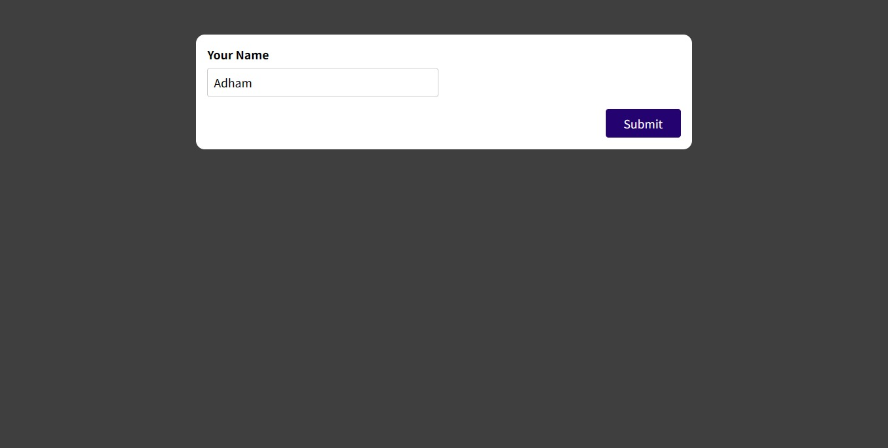

# Simple Form App

A simple React application with a basic form to collect user information.

## Table of Contents

- [Simple Form App](#simple-form-app)
  - [Table of Contents](#table-of-contents)
  - [Overview](#overview)
  - [Project Structure](#project-structure)
  - [Usage](#usage)
  - [Custom Hooks](#custom-hooks)
    - [`useInput`](#useinput)
  - [Components](#components)
    - [`SimpleInput`](#simpleinput)
    - [`BasicForm`](#basicform)
  - [Preview](#preview)
  - [Contributing](#contributing)
  - [Contact Me](#contact-me)

## Overview

This React application consists of a simple form that collects user information. The form includes basic validation for the user's name, ensuring it is not empty. The application showcases the use of custom hooks for handling form input.

## Project Structure

The project structure is organized as follows:

- `src/`
  - `components/`: Contains React components used in the application.
  - `hooks/`: Custom hooks for handling form input.
  - `App.js`: Main application component.
  - `index.js`: Entry point of the application.

## Usage

1. Enter your name in the input field.
2. Submit the form to see the results.

## Custom Hooks

### `useInput`

The `useInput` hook manages the state and validation logic for form input fields.

- `value`: The current value of the input field.
- `isValid`: A boolean indicating whether the input value is valid based on validation rules.
- `hasError`: A boolean indicating whether there is an error with the input.
- `valueChangeHandler`: A function to handle changes in the input value.
- `valueBlurHandler`: A function to handle the blur event on the input.
- `reset`: A function to reset the input state.

## Components

### `SimpleInput`

The `SimpleInput` component renders a basic form with an input field for the user's name. It includes validation for ensuring the name is not empty.

### `BasicForm`

The `BasicForm` component is an example of a basic form structure without validation.

## Preview

## Contributing

Feel free to contribute to this project. If you find any issues or have suggestions for improvements, please open an issue or create a pull request.

## Contact Me

If you have any questions or suggestions, feel free to contact me:

- GitHub: [Adham Nasser](https://github.com/Adhamxiii)
- Linkedin: [Adham Nasser](https://www.linkedin.com/in/adhamnasser/)
